# Disneyland Specification

This application is a desktop application for Disneyland. The application should have two types of users (a regular user and an administrator user) which have to provide a username and a password in order to use the application.

The regular user can perform the following operations:

* View list of activities, and search them by different properties.
* Register for open & available activities. An activity is like an OOP class, so it has multiple "instances" (occurrences). An example of activity is Horse Riding, which can have multiple slots open, at which users register.

The administrator can perform the following operations:

* CRUD on activities (different properties, like location, name, max users, availability).
* CRUD on regular users' information.
* Generate two types of report files, one in pdf format and one in txt or html format, with the activities, and registered users in them. The reports need to be saved in a user-selected location (not predefined by the application), similar on how one would save a file from Notepad.

# Elaboration – Iteration 1.1

## Domain Model
[Define the domain model and create the conceptual class diagrams]

In software engineering, a class diagram in the Unified Modeling Language (UML) is a type of static structure diagram that describes the structure of a system by showing the system's classes,their attributes, operations (or methods), and the relationships among objects. The purpose of class diagram is to model the static view of an application. Class diagrams are the only diagrams which can be directly mapped with object-oriented languages and thus widely used at the time of construction.

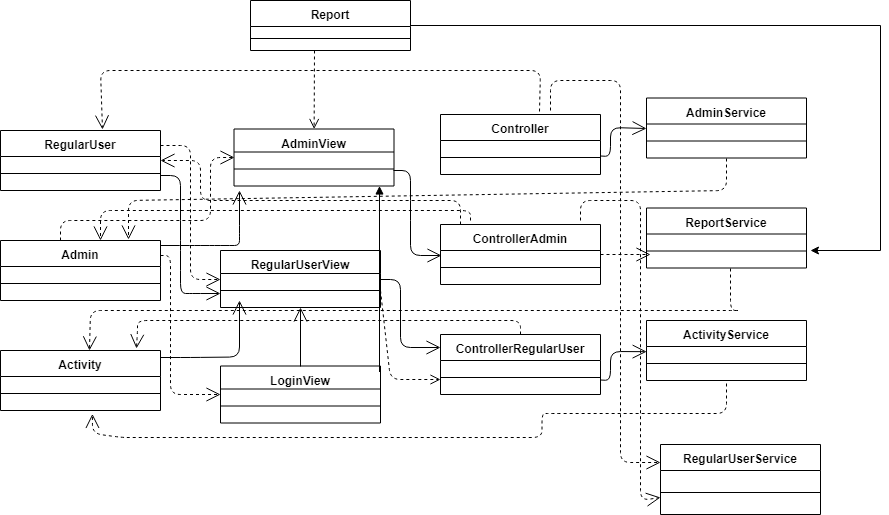

## Architectural Design

### Conceptual Architecture
[Define the system’s conceptual architecture; use an architectural style and pattern - highlight its use and motivate your choice.]

An architecture is an overview, either written or pictorial, that describes the components of a system and the relationship between the components of that system. A conceptual architecture diagram is the formal name given to the pictorial representation of the system architecture. It is a drawing, rendering, or map that visually describes, at a high level, the particulars of the system in question. It is composed of differing blocks that represent the components and a series of line, sometimes with arrows, indicating how the components interact. 

The author of the domain model pattern, Martin Fowler, provides this definition: An object model of the domain that incorporates both behavior and data.

The systems' architecture is based on Layers. The three basic layers used are Presentation represented by the User Interface, Business Logic, where all logic is realized and Persistence layer, represented by the data access logic/classes. The interface of an object conforming to DataMapper would include functions such as Create, Read, Update and Delete.

Some patterns are also used like: Observer, Abstarct Factory, Model View Controler. The application is a Client-Server application based on socket programming. In a ‘conventional’ client–server model, a copy of the client process lies on every client machine and the
client sends a request to the server through a socket to the port that the server is listening on. This model is popular as it offers improved graphical user interface. However, it has the following disadvantages: a copy of the client process has to be installed on every user’s machine and any modification or update to the client process needs to be distributed and installed on every client machine.

A Data Mapper is a Data Access Layer that performs bidirectional transfer of data between a persistent data store (often a relational database) and an in memory data representation (the domain layer). The goal of the pattern is to keep the in memory representation and the persistent data store independent of each other and the data mapper itself. 

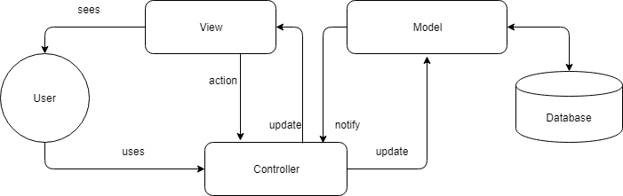

### Package Design
Package diagram, a kind of structural diagram, shows the arrangement and organization of model elements in middle to large scale project. It can show both structure and dependencies between sub-systems or modules, showing different views of a system, for example, as multi-layered (multi-tiered) application - multi-layered application model. 

Package diagrams are used to structure high level system elements. Packages are used for organizing large system which contains diagrams, documents and other key deliverables. In this project, we have four packages: model, view, controller and bl. 

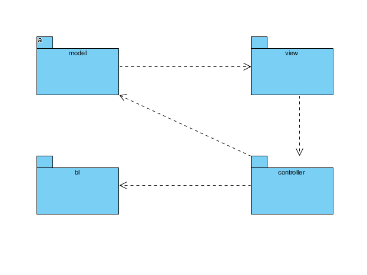

### Component and Deployment Diagrams
Component diagrams are used in modeling the physical aspects of object-oriented systems that are used for visualizing, specifying, and documenting component-based systems and also for constructing executable systems through forward and reverse engineering. Component diagrams are essentially class diagrams that focus on a system's components that often used to model the static implementation view of a system.

A component represents a modular part of a system that encapsulates its contents and whose manifestation is replaceable within its environment.

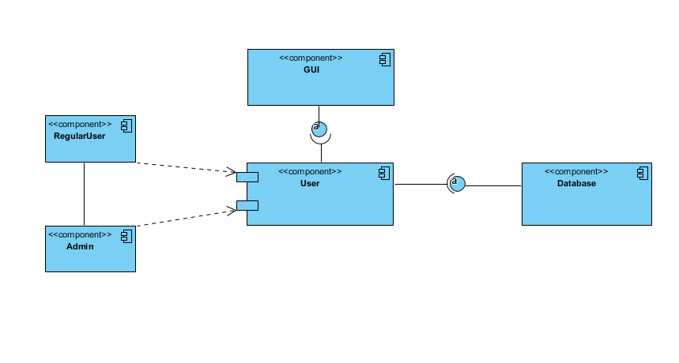

A deployment diagram is a UML diagram type that shows the execution architecture of a system, including nodes such as hardware or software execution environments, and the middleware connecting them.

Deployment diagrams are typically used to visualize the physical hardware and software of a system. Using it you can understand how the system will be physically deployed on the hardware.

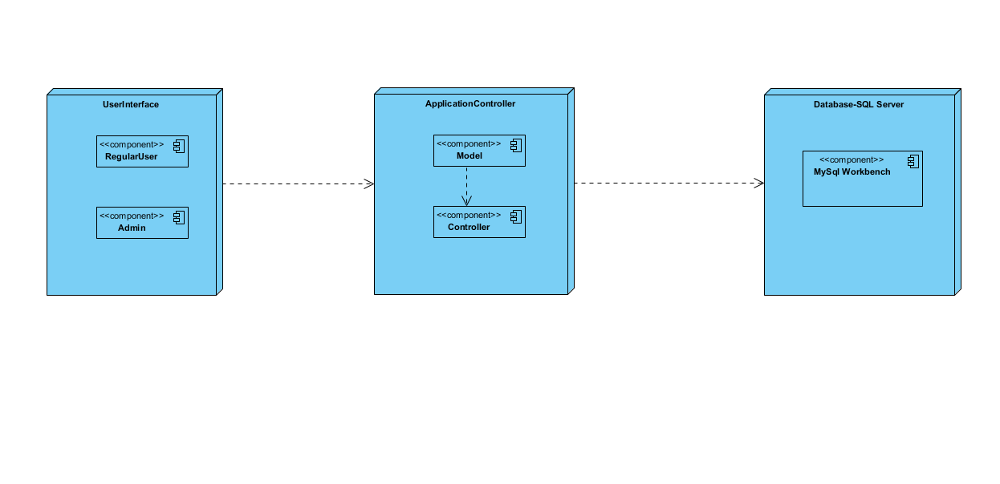

# Elaboration – Iteration 1.2

## Design Model

### Dynamic Behavior

Sequence diagrams are a popular dynamic modeling solution in UML because they specifically focus on lifelines, or the processes and objects that live simultaneously, and the messages exchanged between them to perform a function before the lifeline ends.

Sequence Diagram for Login: 

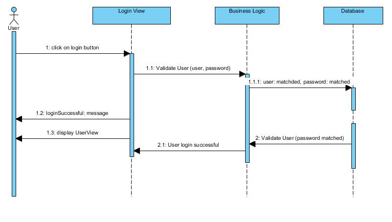

Sequence Diagram for Creat an Activity: 

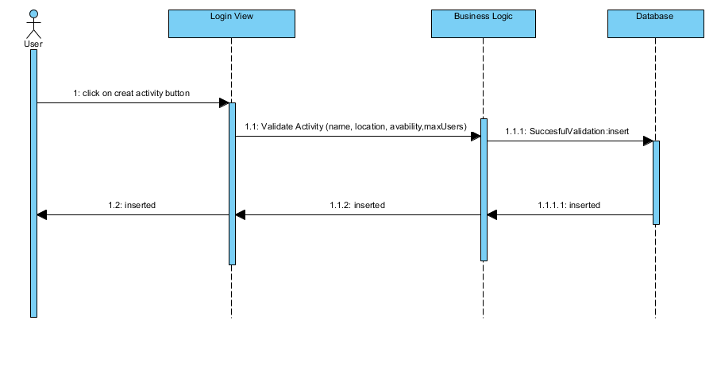

UML communication diagrams, like the sequence diagrams - a kind of interaction diagram, shows how objects interact. A communication diagram is an extension of object diagram that shows the objects along with the messages that travel from one to another. In addition to the associations among objects, communication diagram shows the messages the objects send each other.

Communication Diagram for Login:

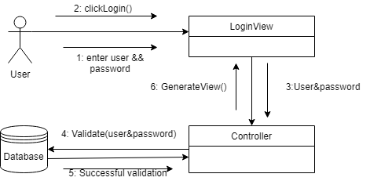

Communication Diagram for Creat an Activity:

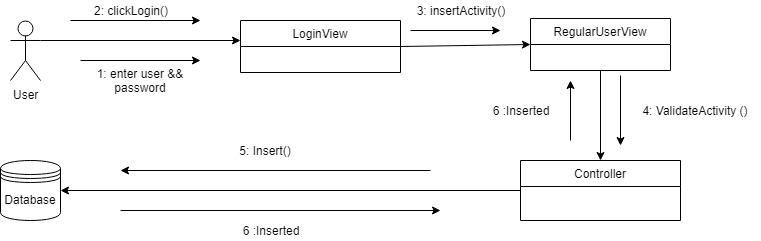

### Class Design

Abstract Factory patterns work around a super-factory which creates other factories. In Abstract Factory pattern an interface is responsible for creating a factory of related objects without explicitly specifying their classes. Each generated factory can give the objects as per the Factory pattern.

Observer pattern is used when there is one-to-many relationship between objects such as if one object is modified, its depenedent objects are to be notified automatically. Observer pattern falls under behavioral pattern category.

The classes from the Persistence layer for data access are named with DAO(Classes for models which has CRUD operations on them): ActivityDAO, AdminDAO, RegularUserDAO. The business logic layer contains the classes which interact with the Persistece Layer in order to obtain data from or introduce data in the database. It also contains classes for the server side of the application, classes which implement the Observer and Oservable Interfaces in order for the  Administrator to be notified, and classes(whith specific dependencies) for Abstract Factory Pattern realization in order to generate reports.

Observer pattern:

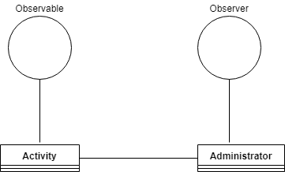

Abstract Factory pattern:

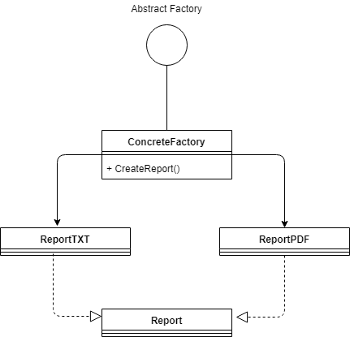

### Data Model

A data model is an abstract model that organizes elements of data and standardizes how they relate to one another and to properties of the real world entities. For instance, a data model may specify that the data element representing a car be composed of a number of other elements which, in turn, represent the color and size of the car and define its owner.

The system models are: Administrator, Regular User, Activity. The Administrator has a unique password and username for log in, that way he can perform crud operations on RegularUsers/Activities. The Administrator can be notified for activities registration, change activity's state to one of the following: scheduled (the initial state when the activity is created), in progress, done, change user's subscription which limits the number of activities he can participate in one day, edit the ratings. The Regular User can Search different Activities, Register at Activities, creat a favorite list of Activities, rate once the activities (between 1-5 stars) and also search by rating, unregister before the event starts, queue-register at activities that are already fully booked and they will get a live notification when a spot is opened up and their place was automatically booked. The Activity is the model for the Activities in this park; it has to do with what activity can perform a regular user when he arrives here. It also has a location and name, max users and avability. 

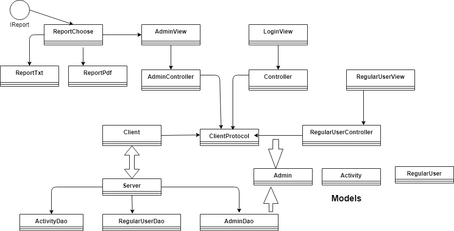

### Unit Testing

A unit test is a piece of code written by a developer that executes a specific functionality in the code to be tested and asserts a certain behavior or state. A unit test targets a small unit of code, e.g., a method or a class. External dependencies should be removed from unit tests, e.g., by replacing the dependency with a test implementation or a (mock) object created by a test framework. Unit tests are not suitable for testing complex user interface or component interaction.

Testing methods:
 * Assertions - Desygn By Contact: Preconitions and Postconditions
 * JUnit testing  

 A JUnit test is a method contained in a class which is only used for testing. This is called a Test class. To define that a certain method is a test method, annotate it with the @Test annotation. This method executes the code under test. We use an assert method, provided by JUnit or another assert framework, to check an expected result versus the actual result. These method calls are typically called asserts or assert statements.
 
Test Scenario: 
 * Validate the login page
   * Test Case 1: Enter a valid username and password
   * Test Case 2: Reset your password
 * Validate input data
   * Test Case 1: Enter valid data
   * Test Case 2: Enter invalid data
   * Test Case 3: Required information doesn't exist in the database
 * User interface testing
 * Functionality testing
 * Limited number of users

# Elaboration – Iteration 2

## Architectural Design Refinement
[Refine the architectural design: conceptual architecture, package design (consider package design principles), component and deployment diagrams. Motivate the changes that have been made.]

## Design Model Refinement
[Refine the UML class diagram by applying class design principles and GRASP; motivate your choices. Deliver the updated class diagrams.]

# Construction and Transition

## System Testing
[Describe how you applied integration testing and present the associated test case scenarios.]

## Future improvements
[Present future improvements for the system]

# Bibliography
- [Architectural Styles](https://docs.microsoft.com/en-us/azure/architecture/guide/architecture-styles/)
- [Architectural Patterns and Styles](https://msdn.microsoft.com/en-us/library/ee658117.aspx)
- [Online diagram drawing software](https://yuml.me/) ([Samples](https://yuml.me/diagram/scruffy/class/samples))
- [Yet another online diagram drawing software](https://www.draw.io)
